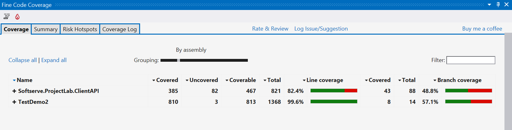
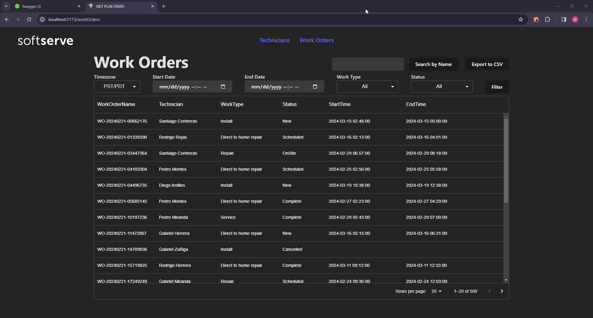
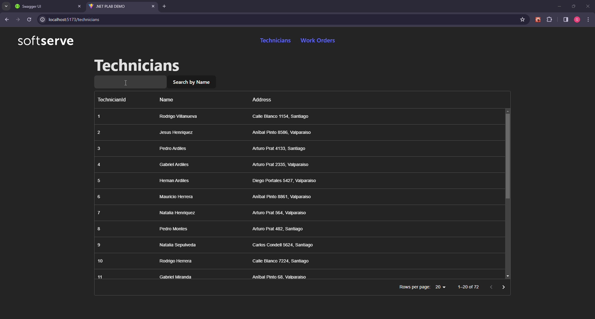

# CL .NET Project LAB API

## Contents
1. [Introduction](#1-introduction) 
2. [Getting Started](#2-getting-started) <br>
   2.1. [Prerequisites](#21-prerequisites) <br>
   2.2. [Initial Setup and Configuration](#22-initial-setup-and-configuration) 
3. [Basic Usage](#3-basic-usage) <br>
   3.1. [Basic Operations and Examples](#31-basic-operations-and-examples) 
4. [Project Architecture](#4-project-architecture) <br>
   4.1. [Model-View-Controller (MVC)](#41-model-view-controller-mvc-architecture) <br>
   4.2. [Service Pattern](#42-service-pattern) <br>
   4.3. [Dependency Injection](#43-dependency-injection)<br>
   4.4. [Benefits](#44-Benefits)
5. [Security Features and Best Practices](#5-security-features-and-best-practices) <br>  
6. [Advanced Functionalities](#6-advanced-functionalities) <br>
   6.1. [API Connection](#61-api-connection) <br>
   6.2. [Work Order Filtering](#62-work-order-filtering) <br>
   6.3. [Search Technician By Name](#63-search-technician-by-name) <br>
   6.4. [Report Generation](#64-report-generation)<br>
   6.5. [Testing](#65-testing) <br>
   6.6. [Data Query](#66-data-query)<br>
   6.7. [Frontend](#67-frontend)<br>
7. [Error Handling](#7-error-handling) <br>
   7.1 [Try Catches](#71-try-catches)<br>
   7.2 [Input Validation](#72-input-validation)<br>

8. [Contribution](#8-contribution)
9. [License](#9-license)

## 1. Introduction


This project offers a streamlined approach to managing and querying Work Orders, along with the Technicians linked to them. Designed with a focus on functionality and ease of use, the system offers advanced capabilities for filtering and searching information, significantly improving operational efficiency. The project's standout features include:


**Work Order Queries:** This feature enables comprehensive searches for Work Orders. Users can filter and explore the data using various criteria.

**Technician Search:** A key aspect of the project is the capability to locate Technicians and display their related Work Orders, aiding in rapid personnel identification.

**Customized Report Generation:** The system is equipped to compile data into well-organized, structured reports.

In terms of architecture, the project consists of two primary segments: Back-end and Front-end, designed to work together to provide a comprehensive solution. The Back-end, developed with .NET technologies, is responsible for communication with the Work Order API and plays a crucial role in the handling and processing of data. The Front-end, built using React JS technology, allows users to interact intuitively with the system's functionalities. This integration facilitates access to and management of Work Orders and Technician information.


# 2. Getting Started
## 2.1 Prerequisites
Before starting the project, it's important to set up the right development environment. This step involves configuring two key components that are essential for a smooth start with the system.

### Docker:

This tool is used for creating and managing containers that bundle applications and services. In this project, Docker is key for setting up a connection to the Work Orders API. To get started, download and install Docker Desktop from the [official Docker Desktop Download website](https://www.docker.com/products/docker-desktop), making sure it's compatible with your operating system. Post-installation, running `docker --version` in the command line is recommended to verify the setup.
### .NET SDK Version 8.0:
Crucial for application development using .NET
technology, .NET SDK Version 8.0 can be obtained from Microsoft's official .NET downloads page [.NET Version 8 Download](https://dotnet.microsoft.com/es-es/download/dotnet/8.0). After installation, executing `dotnet --version` in the command line is advisable to confirm successful installation.

### Node Package Manager (NPM):

Critical for managing Node.js packages and project dependencies, NPM facilitates code sharing and reuse. Installation involves downloadingk Node.js from the [Node.js Downloads](https://nodejs.org/en/download), which includes NPM. Node.js should be chosen based on system compatibility and user recommendations. Post-installation, the presence of Node.js and NPM can be verified by executing `node --version` and `npm --version` commands, respectively, to display installed versions.


## 2.2 Initial Setup and Configuration
### Docker Setup
It is crucial to have access to the API that holds Work Orders information. For security and confidentiality concerns, the necessary file to configure Docker Compose is not included in this repository. However, a detailed description of the structure of this file is provided below, ensuring the protection of the API's security.
``` yaml
version: "3"  # Specifies the version of the Docker Compose format being used.

services:
    workorderapi:
        # Use the Docker image of the WorkOrders API.
        image: <api-image> 

        environment:
            # Configures the environment variable for the .NET API to listen on port 80.
          - ASPNETCORE_URLS=http://+:80  
        ports:
            # Connect the container's port 80 to the host's port 80.
          - "80:80"    

        volumes:
            # Mounts the 'sqlite' volume at '/store' path in the container for data persistence.
            - sqlite:/store  

volumes:
     # Defines a volume named 'sqlite' that will be used by the workorderapi service
     sqlite:

```
### Starting the Service
To initialize the service, run `docker-compose up`. This action will start the necessary service to access the routes containing Work Orders resources, including entities such as WorkOrder, Technician, Status, and WorkType.

### Running the .NET Server
Open the .NET solution file in the DEMO2 directory with Visual Studio to open the project. The project, set up as a Web API, supports both HTTP and HTTPS. In Visual Studio, you can choose the running mode (HTTP or HTTPS) for added security in data transmission. This is usually done by selecting the right option in the toolbar to run the application as a Web App.

### Running the User Interface
Within the directory **SoftServe.ProjectLab.ReactFrontEnd**, execute `npm install` to install the necessary node packages. Following the completion of the installation process, initiate the command `npm run dev` to start the React application. This application utilizes Vite for an optimized development environment, enabling rapid development cycles and efficient module replacement.


# 3. Basic Usage
## 3.1 Basic Operations and Examples


Here are some examples of how you can interact with the API:
- **Get all work orders**: To get all work orders, you can use the following curl command in Postman:
    - curl -X 'GET' \
    'https://localhost:7178/api/WorkOrder' \
    -H 'accept: application/json'


- **Get all work order details**: To get all work order details, you can use the following curl command in Postman:
	- curl -X 'GET' \
    "https://localhost:7178/api/WorkOrderDetails/all \
    -H 'accept: application/json'

- **Get filter work order details** : To get work order details filter by startTime, endTime, workType and status, you can use the following curl command in Postman:
    - curl -X 'GET' \
    "https://localhost:7178/api/WorkOrderDetails?startTime=`$start_time`&endTime=`$end_time`&workType=`$work_type`&status=`$status"` \
    -H 'accept: application/json' \
    - Replace `$start_time`, `$end_time`, `$work_type` and `$status` with the desired values. 

For more information while the project is running, the Swagger user interface can be accessed  via the '/swagger' route on your local server. In this case, it would be [https://localhost:7178/swagger](https://localhost:7178/swagger). In the Swagger interface, you will find a list of all the API routes available in the application. You can expand each route to see the details, such as the supported HTTP methods (GET, POST, etc.), the expected input parameters, and the response formats. You can also test the routes directly in the Swagger interface, which is very useful for debugging and development.
# 4. Project Architecture
This project utilizes the Model-View-Controller (MVC) architecture, the Service pattern, and the Dependency Injection pattern.
## 4.1 Model-View-Controller (MVC) Architecture

**The MVC architecture** was chosen for its ability to separate the application logic from the presentation, making code management and maintenance easier. This separation allows for more agile development and facilitates collaboration between teams.


**Implementation:**
In the project, the MVC architecture is implemented using the ASP.NET MVC framework. The three main components of MVC are defined as follows:

- Model: Contains the business logic and application data.
- View: Presents information to the user through web interfaces.
- Controller: Manages user interaction with the application, processing requests and responses.
## 4.2 Service Pattern
**The service pattern** encapsulates business logic in independent classes called "services." This encapsulation facilitates code reuse and improves system modularity.

**Implementation:**
Services are implemented as independent classes that encapsulate specific business logic. Controllers interact with services to perform tasks such as data retrieval, user management, or specific process execution


## 4.3 Dependency Injection
**The dependency injection pattern** decouples system components by providing them with the dependencies they need through an IoC container. This facilitates the creation of independent unit tests and improves code flexibility.

**Implementation:**
The project uses constructor dependency injection to provide the necessary dependencies to the different components. The IoC container is responsible for creating and managing dependency instances.

## 4.4 Benefits
The implementation of the mentioned architectures and design patterns has yielded the following benefits:

- **Modularity and flexibility:** The code is more modular and flexible, making it easier to maintain and evolve.
- **Separation of concerns:** Business logic, presentation, and data management are clearly separated, improving code readability and maintainability.
- **Ease of testing:** The implemented architecture and patterns facilitate the creation of independent unit tests.
- **Scalability:** The MVC architecture and service pattern allow the application to be scaled horizontally by adding new web servers or services as needed.

# 5. Security features and best practices

This section outlines key security strategies and design patterns implemented in the application, ranging from the fundamental MVC pattern that enhances structural integrity to specific technical measures like secure HttpClient usage and meticulous exception handling.

1. **MVC Pattern Usage**: The application's use of the Model-View-Controller (MVC) design pattern contributes to its security. MVC separates concerns, reducing risks like over-posting and facilitating centralized input validation, thus bolstering the application's defense against common vulnerabilities.

2. **Base Address Configuration**: The ApiConnector class uses an HttpClient with a configured base address. This is a good practice as it centralizes the base URL for API requests, making it easier to manage and ensuring that requests are directed to the correct endpoint. 

3. **Constructor Injection**: Dependency injection is used in the constructor to inject the HttpClient. This is a good design pattern, making the class more modular and testable. It also helps with the management of the HttpClient lifecycle.

4. **HttpClient Usage**: The ApiConnector class uses an instance of HttpClient for making API requests. The HttpClient is a recommended and efficient way to perform HTTP operations. Ensure that the client is properly configured and managed, especially regarding security features like timeouts and handling of sensitive data.

5. **Custom Methods for API Requests**: The class encapsulates specific methods for making API requests, such as GetAsync and PostAsync. This abstraction provides a clear and maintainable interface for making different types of requests. Ensure that these methods handle responses and errors appropriately, including proper validation and error handling.

6. **Service Abstraction**: The ApiConnector class implements an IApiConnector interface. This abstraction allows for easy substitution of the implementation, supporting better unit testing and adherence to the dependency inversion principle.

7. **HttpClient Factory**: The class does not explicitly manage the lifecycle of the HttpClient, which suggests that it may be relying on the HttpClientFactory introduced in ASP.NET Core. The factory manages the creation and disposal of HttpClient instances, reducing the risk of socket exhaustion and improving performance and security.

8. **Exception Handling**: The ApiConnector class includes exception handling for HttpRequestException. Proper exception handling is crucial for robust and secure communication with APIs. However, it's important to handle exceptions with care, avoiding the exposure of sensitive information in error messages.

9. **Async/Await Pattern**: The methods in the ApiConnector class use the asynchronous programming pattern (async/await). This can contribute to better responsiveness and scalability in the application.

10. **HTTPS Usage**: The application is configured to use HTTPS, as indicated by the usage of UseHttpsRedirection() middleware. This ensures that data exchanged between the client and server is encrypted, enhancing security.

11. **CORS Configuration**: Cross-Origin Resource Sharing (CORS) is configured with a specific policy named "AllowSpecificOrigin," which allows requests from "https://localhost." This helps control which domains can access resources on the server, preventing unauthorized cross-origin requests.

12. **Swagger Integration**: Swagger is integrated into the project, allowing for interactive API documentation. While this is not a direct security feature, it aids developers in understanding the API and facilitates testing. Ensure that Swagger is disabled or protected in production environments to prevent unauthorized access.

13. **Dependency Injection**: The code uses dependency injection to register and resolve services. This promotes a modular and testable design, which indirectly contributes to security by facilitating code maintainability and reducing the risk of vulnerabilities.

14. **HttpClient Configuration**: An HttpClient is configured with a base address. This is a good practice for managing API requests, and it's important to validate and sanitize inputs when using external URLs.
    
15. **Configuration Isolation**: Configuration settings, such as the base address for the API client and allowed hosts, are stored in the appsettings.json file. Proper configuration management helps in maintaining sensitive information securely.

16. **Error Handling**: The error handling approach is considered, with a generic error page displayed in development mode. However, ensure that detailed error information is not exposed in a production environment for security reasons.

17. **Minimal Logging of Sensitive Information**: The logging configuration in appsettings.json suggests that sensitive information is not logged at an extensive level, which is a good practice for security.

# 6. Advanced functionalities
## 6.1 API Connection
### Functionality Description
This project includes a dedicated module, called `APIConnector.cs`, for setting up and managing connections with various resources like Technician, WorkOrders, Status, and WorkType from the WorkOrders API. This module is fundamental for the application, as it oversees the management of HTTP requests and responses to and from the WorkOrders API.

### Module Capabilities
1. **HTTP Client Management**: Uses `HttpClient` for sending HTTP requests and receiving responses from the API, ensuring smooth communication.

2. **Retry Logic**: Adds a retry mechanism to address temporary failures in API calls. It typically retries a request up to three times with a set delay, boosting dependability.

3. **Response Handling**: Processes and checks API responses, ensuring successful requests and appropriate error management.

4. **Generic Data Fetching**: Capable of retrieving data of any type (`T`) from the API, accommodating different data models effectively.

#### Libraries Used
1. `System.Net.Http`: Essential for initiating HTTP requests and processing responses.

2. `Newtonsoft.Json`: Was chosen for its strong capabilities in serializing and deserializing JSON data, ensuring broad compatibility across various .NET versions and platforms.

3. `IHttpClientFactory`: Utilized for creating `HttpClient` instances. This method improves the management of `HttpClientHandler` life cycles and supports socket pooling, leading to better efficiency.

## 6.2 Work Order Filtering
This function is designed to retrieve detailed information about work orders based on specific criteria like time period, work type, and status. It leverages data from multiple sources to present a comprehensive view of each work order.
### Functionality Description
**1. Time Frame Filtering:** Filters work orders based on a specified start and end time.

**2. Work Type Filtering:** Allows filtering of work orders based on a specific type of work. Includes an option to select 'all' types.

**3. Status Filtering:** Permits filtering by the status of work orders, with the ability to choose 'all' statuses.

**4. Data Joining:** Joins data from separate entities, such as technicians, work types, and statuses, to form a complete picture of each work order.
### LINQ Usage
The function employs LINQ for its data processing needs, particularly using the following methods:

**1. Join Operations:** Utilizes LINQ's join clause to merge data from technicians, work types, and statuses with work orders.

**2. Where Clause:** Employs where to filter work orders based on the provided criteria, such as time frame, work type, and status.

**3. Select Projection:** Uses select to project the filtered data into the WorkOrderDetails structure.

**Pseudocode Example:**
``` csharp
var query = workOrders
            .Join(technicians, ...)
            .Join(workTypes, ...)
            .Join(statuses, ...)
            .Where(
                wo.StartTime.HasValue &&
                wo.EndTime.HasValue &&
                wo.StartTime.Value >= startTime &&
                wo.EndTime.Value <= endTime &&
                (workType == "all" || wt.Name.Equals (workType,StringComparison.OrdinalIgnoreCase)) &&                  
               (status == "all" || st.Name.Equals(status,StringComparison.OrdinalIgnoreCase))                
             ).Select(wo => new WorkOrderDetails { ... });

``` 

## 6.3 Search Technician By Name
Designed to facilitate the querying of a database or dataset to retrieve details about technicians based on their names. It provides a robust and flexible way to handle various types of name-based searches, ensuring accurate and relevant results.
### Functionality Description
**1. Full Name Search:** Allows users to search for technicians by providing a full name (both first and last name). The function returns details for technicians whose names exactly match the input.

**2. First or Last Name Search:** Users can search by either first name or last name. The function will return all technicians matching the given name component.

**3. Case Insensitivity:** The search is case-insensitive, meaning searches for "John Doe," "john doe," or "JOHN DOE" will yield the same results.

**4. Special Character Handling:** The function recognizes and accurately processes names containing special characters (like accents, hyphens, etc.).

**5. Exact Match Requirement:** It requires an exact match of the search term. Hence, partial name searches or searches with typing errors return an empty list.

**6. Unordered Name Search:** The function does not support unordered name searches. If the name components are provided in a different order than what is recorded, the function will not capture those names.


### LINQ Usage
The LINQ expression used in the "Search Technician By Name" function primarily revolves around two key LINQ methods: Where and Select.

**1. Where():** This is used to filter the list of technicians. It checks each technician's name, split into lower-cased words, against the search terms to find an exact match in the correct sequence.

**2. Select():** This projects the filtered technicians into a new form, TechnicianDetails, which includes nested LINQ queries within to fetch related WorkOrderDetails.

The algorithm processes each technician's name to match all search terms in order. It splits the name into words, iterating through them to ensure each search term is found sequentially. Once a technician passes this filter, they are transformed into TechnicianDetails objects, with an additional nested LINQ query fetching their associated WorkOrderDetails.


``` csharp

var filteredTechnicians = technicians
    .Where(t => {
        var techNameWords = t.Name.ToLowerInvariant().Split(' ');
        int searchTermIndex = 0;
        foreach (var word in techNameWords) {
            if (word.Equals(searchTerms[searchTermIndex])) {
                searchTermIndex++;
                if (searchTermIndex == searchTerms.Length) {
                    // All search terms matched in order
                    return true; 
                }
            }
        }
        // Not all search terms matched
        return false;     
})
    .Select(tech => new TechnicianDetails {
        // Project to TechnicianDetails including nested LINQ for WorkOrders
    })
    .ToList();
``` 

## 6.4 Report Generation
Designed to facilitate the creation of comprehensive reports from work order data.
### Functionality Description
**1. Data Retrieval:** The function retrieves all necessary data, which includes details about the work order, such as the technician assigned, the status of the work order, and the type of job being performed.

**2. Data Processing:** Once the data is retrieved, it is processed and joined together to form a comprehensive report. This involves transforming the data into a suitable format and organizing the data in a way that is easy to understand.

**3. CSV Export:** Exports the report data as a CSV file. This CSV file can be downloaded and used for further analysis or record-keeping.


### LINQ Usage
The function employs LINQ for its data processing needs, particularly using the following methods:

**1. Join Operations:** Utilizes LINQ's join clause to merge data from technicians, work types, and statuses with work orders.

**2. Where Clause:** The Where clause is used to filter the work orders to include only those where both StartTime and EndTime have a value.

**3. Select Projection:** Uses select to project the filtered data into the ReportData structure.

**Pseudocode Example:**
``` csharp
var query = workOrders
            .Join(technicians, ...)
            .Join(workTypes, ...)
            .Join(statuses, ...)
            .Where(wo.EndTime.HasValue && wo.StartTime.HasValue
             ).Select(wo => new ReportData { ... });

``` 
## 6.5 Testing
The tests focus on ensuring the correctness and functionality of various services within the application and controllers. In the tests for various services and controllers, mocking is used extensively to replicate the behavior of external API calls, database interactions, and even internal service responses.

### What is Mocking?

Mocking involves creating objects that simulate the behavior of real objects in a controlled way. It's used extensively in unit testing to ensure a component can be tested in isolation from its dependencies. This technique is critical for verifying the internal logic of a component without relying on its external dependencies.

### Benefits of Mocking

Mocking is crucial for several reasons:

1. **Isolation of Test Environment**: Ensures tests are isolated from external changes like API endpoint changes or database schema updates, helping accurately identify the source of test failures.
2. **Controlled Data**: Supplies tests with controlled data to cover a wide range of scenarios, including edge cases, ensuring thorough testing of component behavior.
3. **Efficiency**: Reduces the time tests take to run by eliminating the overhead of real network calls or database interactions, making the development process more efficient.
4. **Error and Edge Case Testing**: Allows for the simulation of error conditions and edge cases that are difficult to generate in a real environment, testing system resilience.


### Testing Components Overview

| Test Component                 | Key Assertions                                                                                                         |
|--------------------------------|-------------------------------------------------------------------------------------------------------------------------|
| **ApiConnectorTest**           | Verifies connector parses responses and handles errors correctly.                                                       |
| **StatusServiceTest**          | Confirms non-null response and accuracy of status objects.                                                              |
| **TechnicianControllerTest**   | Focuses on routing, status code responses, and data accuracy.                                                           |
| **TechnicianServiceTest**      | Ensures correct handling of non-null responses and data integrity.                                                     |
| **WorkOrderControllerTest**    | Asserts correct HTTP status codes and response content.                                                                 |
| **WorkOrderDetailsServiceTest**| Verifies completeness and accuracy of work order details.                                                               |
| **WorkOrderServiceTest**       | Confirms non-null list of work orders with accurate details.                                                            |
| **WorkTypeTest**               | Checks for non-null response, correct count, and accuracy of ID and name.                                               |
| **WorkOrderDetailsControllerTest** | Ensures responses are accurate, complete, and properly formatted, including error scenarios.                          |

### Fine Code Coverage
Fine Code Coverage is utilized to evaluate how much of the source code is covered by automated tests, aiming to identify untested sections for improvement.

- **Coverage Results**: The application achieved an 82.4% code coverage, indicating a comprehensive testing strategy that extensively covers the codebase.
- **Excluded Modules**: Certain modules were excluded from coverage analysis for specific reasons:
   - **Migrations**: Contains default, auto-generated files.
   - **View Models**: Excluded due to the planned migration to React.js, making current tests less relevant.
   - **Program**: The build file, considered private and typically not needing tests.

 
 
 *SoftServe Project Lab Demo 2 - Fine Code Coverage Results*

All tests for the StatusService, TechnicianService, WorkOrderService, and WorkTypeService have successfully passed, confirming the reliability and correctness of these key components of the application.

## 6.6 Data Query
Data querying in the React application mainly happens on two important pages: Work Orders and Technician Pages. To understand how the data query functionalities work, it's important to know the following concepts:

### Fetching
Fetching is the process of requesting data from external sources, such as APIs, crucial for dynamic content display in React applications. It involves:

**1. Making the Request:** Utilize the fetch API or third-party libraries like Axios to send requests to a server. Specify the resource URL, method (GET, POST, etc.), and any necessary options.

**2. Handling the Response:** Process the server's response, typically by converting it to JSON format, to retrieve the desired data.

### React Hooks

Functional components use Hooks for managing state and side effects. Two of the most commonly used hooks are useState and useEffect.

The **useState** hook is a fundamental feature in React, enabling state management capabilities in functional components. It provides a mechanism to create a piece of state and a function to update it. This state is preserved between re-renders of the component, allowing for dynamic tracking and modification of values, such as user inputs or application data, throughout the component's lifecycle, enhancing interactivity and user experience.

The **useEffect** hook is a tool for performing side effects in functional components. It serves to execute code after the completion of render cycles, enabling operations like data fetching, subscriptions, or manually changing the DOM that are separate from the main UI render logic. Developers can specify dependencies to control when the effect runs, ensuring it executes only when certain values change, optimizing performance and resource usage.

### Toasts
Toasts provide feedback messages from the system, such as success or error notifications, enhancing user interaction by confirming actions or displaying errors without disrupting the user experience.

### Work Order Page:

#### Initial Loading
- **useEffect Hook:** Triggers the initial data fetching for work orders, executing when the component mounts to the DOM.
- **getWorkOrders Function:** An asynchronous function called within useEffect to fetch Work Order data from the API.
- **useState Hook:** Upon successful data fetching, useState updates the UI with the fetched data using setWorkOrders, which is then passed to and displayed by the ListWorkOrders component.
- **Error Handling:** If data fetching fails, error messages are displayed using toasts, maintaining clear communication with the user.

#### WorkOrder Search
- Initiates a request to the search API endpoint.
- On success, displays the fetched data in a dialog component using setFoundWorkOrder to update the state.
- Utilizes toasts to inform the user upon unsuccessful responses, preventing display of incorrect data.

#### Filter Functionality
- Executes a filtered search by calling the API with specific parameters.
- Displays a loading toast to inform the user that the data is being processed.
- Reuses setWorkOrders to update the UI with the filtered results, maintaining consistency in data structure and display.

#### CSV Exporting
- Fetches the CSV file from the API.
- Creates a blob URL for the file and appends it to the document for downloading.
- Automatically triggers the download link and subsequently removes it from the document to keep the UI clean.

### Technician Page:

#### Initial Loading
- Similar to the Work Order page, the initial load uses useEffect for fetching, useState for state management, and toasts for error handling.
- Technician data is fetched, processed, and displayed using a similar pattern, ensuring consistency across different page functionalities.
#### Search Handling
- Executes a search based on user input.
- Updates the technician data or sets an empty array using useState to indicate no results, with user feedback provided via toasts.

## 6.7 Frontend
The frontend for this project, developed using Blazor, offers a dynamic and intuitive interface for efficient management of work orders and technicians. The work order view includes capabilities for filtering and exporting work order information, enhancing the overall functionality and user experience. The Technician view provides list and search capabilities, allowing for efficient data access and management. These elements come together to create a seamless, interactive platform for effective data management and analysis. The following views provide insights into the key views of the system, showcasing their design and practical features for efficient data management:

#### Work Orders view


*SoftServe Project Lab Demo 3 - Work Orders View*

#### Technician View


*Softserve Project Lab Demo 3 - Technicians View*


# 7. Error Handling
## 7.1 Try Catches
In this project, we use `try-catch` blocks to handle errors and exceptions that may occur during code execution. This allows us to control the flow of the program and provide meaningful responses in case something goes wrong.

### Services

In our services, such as `WorkOrderService`, `TechnicianService`, `StatusService`, `WorkTypeService`, and `ApiConnector`, we use `try-catch` blocks to handle errors that may occur when making API requests. If an error occurs, we log the error message and then throw the exception so it can be handled further up the call stack.

For example, here's how we handle errors in `WorkOrderService`:
``` csharp
public async Task<WorkOrder[]> GetWorkOrdersAsync()
{
    try
    {    
        return await _apiConnector.GetAsync<WorkOrder[]>(ApiUrls.GetAllWorkOrders);
    }
    catch(Exception ex)
    {
        Console.WriteLine($"Error with GetAllWorkOrders: {ex.Message}");
        throw;
    }
}
```
### Controllers 
In our controllers, such as `WorkOrderController`, `TechnicianController`, and `WorkOrderDetailsController`, we also use `try-catch` blocks to handle errors. However, instead of just logging the error and throwing the exception, we return an HTTP error response to the client.

For example, here's how we handle errors in `WorkOrderController`:
``` csharp
[HttpGet]
[ProducesResponseType(typeof(List<WorkOrder>), StatusCodes.Status200OK)]
[Produces("application/json")]
public async Task<IActionResult> Get()
{
    try
   {
       var workOrders = await _workOrderService.GetWorkOrdersAsync();
                return Ok(workOrders);
    }
            catch (Exception ex)
    {
                return BadRequest(ex.Message);
    }
}
```
This approach allows us to handle errors proactively and ensure that our program can recover from unexpected errors gracefully.

### Frontend pages
In the frontend pages: Technicians and WorkOrders sections, we implement a robust error handling strategy using try-catch blocks, similar to our backend services. This strategy includes a double layer of try-catch blocks to effectively manage any issues that may arise either during the data fetching or its subsequent handling. If the fetch operation fails or processing errors occur, we inform the user through clear, user-friendly error messages using toasts. This method ensures a seamless user experience even when unexpected errors occur, reinforcing the resilience and reliability of our application's frontend.

For example, this is a function to handle Work Orders Loading in the Work Orders page:
``` typescript
const getWorkOrders = async () => {
      setIsLoading(true);
      try {
        const response = await fetch(
          "https://localhost:7178/api/WorkOrderDetails/all"
        );
        if (response.ok) {
          const data = await response.json();
          setWorkOrders(data);
        } else {
          toast.error("Failed to fetch data", {
            position: "top-right",
            theme: "dark",
          });
        }
      } catch (error) {
        console.error(error);
        toast.error("Error processing data", {
          position: "top-right",
          theme: "dark",
        });
      }
      setIsLoading(false);
    };

```

## 7.2 Input Validation
Input validation in the application is performed both on the client (frontend) and server (backend) sides, ensuring robust data integrity and improving user experience.

### Front End Validation
Front-end validation focuses on immediate user feedback and guides users to enter valid data, especially in features like Search Technician by Name and Work Order filtering.

1. **Search Technician by Name**:
   - **Character Restrictions**: The input field is designed to accept only word characters and spaces. This restriction prevents the entry of special characters that could potentially cause errors or security vulnerabilities.
   - **Empty Search Handling**: If a user conducts a search with an empty input, the system performs a call to retrieve all technicians. This feature ensures that the user is still presented with relevant data, preventing confusion or a blank response.

2. **Work Orders**:
   - **Date Selection**: Date pickers are used for selecting time ranges. These intuitive controls help prevent the entry of invalid dates and enhance the overall user experience.
   - **Dropdown Selectors**: Dropdown selectors are implemented for fields such as work type and status, rather than open text inputs. This design choice limits user input to predefined, valid options, thereby reducing the likelihood of errors or invalid data submissions.


### Backend Validation
The backend validation is more about data integrity and preventing invalid data from being processed or stored.
1. **Work Orders Services**: 
   - `GetWorkOrdersAsync`: Primarily fetches work order data without direct input validation as it doesn't take parameters.
   - `GetWorkOrderAsync`: Validates `workOrderName` for null or empty values before making an API call. It ensures that only meaningful strings are processed.
   - `GetWorkOrderDetailsAsync` (Overloaded with parameters): Validates `startTime`, `endTime`, `workType`, and `status`. It ensures that the time range is valid and the strings for work type and status are processed correctly (e.g., handling the "all" case).

2. **Technician Services**:
   - `GetTechniciansAsync`: Retrieves all technicians without specific input validation due to the lack of parameters.
   - `GetTechnicianAsync`: The method seamlessly integrates with existing validation protocols for `technicianId` within the broader API framework, ensuring data integrity and operational coherence.
   - `GetTechnicianByName`: Performs comprehensive validation by rigorously checking for null, empty, or whitespace-only strings in the `technicianName` parameter. It is designed to handle various cases with precision, including ensuring an exact match, maintaining case insensitivity, and accommodating special characters in names.

4. **CSV Report Generation**: On the backend, validation in the context of CSV report generation, particularly in functions like `GetWorkOrderReports`, ensures data integrity and logical consistency, even though it does not directly handle user inputs. The function performs implicit validations, such as:
   - Ensuring the inclusion of work orders only with valid `StartTime` and `EndTime` values, using LINQ where clause to filter out incomplete records.
   - Maintaining data joining integrity by combining work orders with corresponding technicians, work types, and statuses, thereby validating the existence and relevance of the joined data.

# 8. Contribution
This project reflects the collective efforts in the Softserve .NET project lab. The focus has been on backend and frontend development, with notable advancements in key areas like Work Order Queries and Technician Search. Utilization of .NET and Blazor technologies has been instrumental in enhancing project functionality. The project has evolved through problem-solving, innovation, and a commitment to learning and improvement. Future enhancements are anticipated to further develop the project's capabilities, ensuring ongoing progress and efficiency.

# 9. License
This source code is made available for educational purposes only. By using this code, you agree not to use it, or any part of it, for commercial purposes. If you wish to use this code for purposes other than education, please contact the author for permission.
